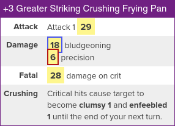
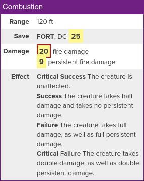

#   Build20

Convert Pathbuilder 2e JSON output to Roll20 macros!





##  Requirements

  - Python 3.9
  - PyYAML 6.0

> Note: This script was tested on BSD 13.1 and Linux 6.1.


##  Build20 Usage

Invoke the script like so:

```
./build20.py [options] [INPUT]
    -o  --output    FILE    Write output to FILE
    -m  --modfile   FILE    Use the modifications in FILE
    -s  --spells    FILE    Also write macros for spells in FILE
    -c  --custom    FILE    Write custom macros contained in FILE
    -n  --noheader          Do not print headers (useful for Roll20 API)
    -h  --help              Print this message
```

The `INPUT` should be a Pathbuilder 2e formatted JSON file ("Menu" > "Export" >
"Export JSON").  You can also paste the JSON in by not specifying an input file.

Copy the macro after each header into a new Roll20 macro.

### Spells

Build20 will also attempt to generate spell macros.  You can improve the spell
descriptions by writing them yourself in a YAML file and specifying the file
with the `-s` or `--spells` switch.  Spells consist of arbitrary key/value pairs
(nesting not supported), and the name of the spell must exactly match.  Build20
will not automatically generate spells for spells you describe in the YAML file.
The following is an example spell:

```yaml
Ignite Fireworks:
  Range: "60 ft"
  Area: |-
    ?{Metamagic| None, 10 ft burst | Widened, **Widened** 15 ft burst}
  Save: |-
    **REFLEX** DC [[$dc]]
  Damage: |-
    [[1d8]] fire damage
    [[1d8]] sonic damage
  Effect: |-
    **Critical Success** The creature is unaffected.
    **Success** The creature takes half damage and is dazzled for [[1]] round.
    **Failure** The creature takes full damage and is dazzled for [[3]] rounds.
    **Critical Failure** The creature takes double damage, takes [[1d4]] persistent fire damage, and is dazzled for [[1]] minute.
```

> You can also add images to your custom spells by including a `img` tag with
> the image's URL.

#### Substitutions

The spells YAML format currently supports three substitutions:
  - `$attack` will be replaced by your caster attack bonus (caster stat +
    proficiency bonus)
  - `$dc` will be replaced by your caster DC
  - `$mod` will be replaced by your spellcasting modifier

### Modifications File

Any field (skill check, saving throw, etc.) can be **modified** with an integer
value by using the `-m` or `--modfile` switch and supplying a **modifications
file**.  Each modification is of the form `FIELD MODIFICATION`, where `FIELD` is
the name of the field and `MODIFICATION` is an integer value.  This file must be
line-delimited, and lines starting with `#` are treated as comments.  Make sure
the `FIELD` exactly matches the Pathbuilder JSON output.  For example, this file
might look like:

```
# Clumsy -1
acrobatics -1
stealth -1
thievery -1
reflex -1
```

To modify spells, use the caster type (e.g. "castingDivine").  To modify attack rolls,
use the name of the weapon (e.g. "Large +1 Greatsword").

### Custom Macros

You can write custom macros in YAML, and Build20 will convert them to Roll20
macros using the `-c` or `--custom` switch.  Each custom macro consists of
arbitrary key/value paris (nesting not supported).

> You can also add images to your custom macros by including a `img` tag with
> the image's URL.

#### Substitutions

Custom macros support much more diverse substitutions.

  - Abilities: `$abl_TAG` Replace TAG with your ability of choice (e.g. `wis,
    cha`)
  - Skills : `$skl_TAG` Replace TAG with your proficiency of choice (e.g.
    `athletics`, `castingPrimal`, `martial`, `unarmored`)
  - Modifier: `$mod_TAG` Replace TAG with your modifier of choice
  - Weapons: `$wep_ID_TAG` Replace ID with your weapon ID (0-indexed, so the
    first weapon on your sheet has ID 0), and replace TAG with your property of
    choice (e.g. `attack`, `damageBonus`, `die`)

The following is a phony example ability to demonstrate how substitutions work:

```yaml
Foo:
  img: 'https://yld.me/raw/hFKA.png'
  Range: '$mod_potato ft'
  Attack: '[[d20 + $wep_0_attack]]'
  Effect: |-
    Make a acrobatics check [[d20 + $skl_acrobatics]]. Target takes $abl_wis **sonic damage**.
```

```text
# Modifiers file
potato 10
```

##  `heal.py`

`heal.py` is a simple script for doing party medicine.  To use it, first write
an input file (each character on its own line, fields space-delimited).

Lines that begin with `healer` denote a character that can use the Treat Wounds
ability.  Specify their Medicine modifier and the desired proficiency to roll
against.  

Lines that begin with `injured` denote a party member that should be the target
of healing.  Specify their name, current HP, and maximum HP.

Your input file may look like so:

```
# Healer MEDICINE DESIRED_PROF
healer 15 expert
healer 8 trained

# Injured NAME CURR_HP MAX_HP
injured char1 54 80
injured char2 23 40
injured char3 55 60
```

Then, invoke the script as follows:

```
./heal.py [options] INPUT
    -t  --time      VALUE   Maximum amount of time (hours)
    -h  --help              Print this message
```

> `injured` party members do not need to be missing HP.  Feel free to mark your
> entire party down at full health and only modify relevant PCs.
